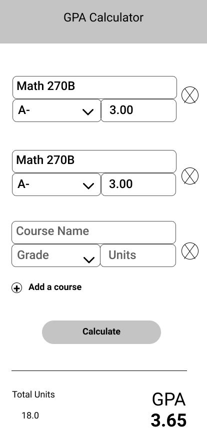

# GP-Aide 🧮

> _"GPA" + "Aide"_

## About 💬

This project is a simple iOS application where users can input their grades and then view their calculated GPA.
The inputted data is locally stored, so the user does not have to enter their grades each time the app is launched.

### Features ✨

- [x] Persistent storage via [`Codeable`](https://developer.apple.com/documentation/swift/codable).
- [x] User interface using [SwiftUI](https://developer.apple.com/xcode/swiftui/).
- [ ] Discover other students who will be taking the same classes before the semester begins.

## Demo 🙈

